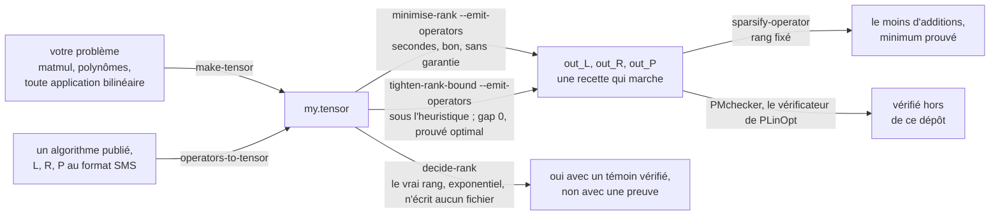

# tensor-rank-toolkit

[](https://github.com/Tewf/tensor-rank-toolkit/actions/workflows/ci.yml)
[](https://tewf.github.io/tensor-rank-toolkit/)
[](LICENSE)

> [Read in English](./)

Une bibliothèque de recherche en C++20 pour le rang tensoriel et bilinéaire
exact sur les corps finis et sur les rationnels. Le rang d'une application
bilinéaire est le nombre de multiplications qu'utilise un algorithme
bilinéaire optimal ; les sept multiplications de Strassen pour le produit de
matrices 2×2 en sont l'exemple classique, et ces rangs sont à l'origine de la
multiplication matricielle rapide. Décider le rang tensoriel est NP-complet
sur les corps finis [`[hastad1990]`](references.md) et ∃ℝ-complet sur les
réels [`[schaefer2018]`](references.md) ; la bibliothèque associe donc des
**procédures de décision complètes**, en temps exponentiel, à des
**heuristiques qui balayent là où les procédures cherchent**, et à des
bornes inférieures qui ne font ni l'un ni l'autre. Toute l'arithmétique est exacte, sur GF(p) et ℚ
via Givaro : une recherche sur des rangs et des comptes de non-nuls donne une
autre réponse quand elle est presque juste, donc rien ici n'est jamais un
flottant. Chaque compte ci-dessous est vérifié par la suite de tests ; les
temps de calcul, eux, non, et rien ne le prétend
([`MEASURING.md`](MEASURING.md) donne le protocole,
[`evidence/reproduce/`](evidence/reproduce/) régénère chaque nombre publié avec sa
provenance). Un lecteur sans le vocabulaire du domaine peut commencer plutôt
par [`start-here.md`](start-here.md) (en anglais).

## Organisation du dépôt

Une ligne par axe : sa question, sa garantie, et son chiffre de tête. La
ligne est toute l'affirmation ; le dossier de l'axe porte la profondeur, et la
forme longue à travers les axes est
[`what-it-computes.md`](what-it-computes.md), en anglais comme le reste de la
documentation technique.

| Axe | Question, et sur quelle garantie | Résultat |
|---|---|---|
| [heuristique gloutonne](methods/bilinear_rank/greedy_heuristic/) | le rang par le haut au prix d'un balayage : des passes gloutonnes sur matroïde sur les `p^(n+m)` candidats de rang un, exacte pour la base de sa première étape, sans garantie au-delà | F2 5x5 à **14**, F3 3x6 à **10** |
| [exhaustion](methods/bilinear_rank/exhaustive/) | le rang tranché : une **procédure de décision complète** d'après [`[bdez2012]`](references.md), exponentielle comme la NP-complétude le laisse attendre | **rang de matmul 2x2 = 7** : 7 trouvé et vérifié, 6 réfuté |
| [séparation et évaluation](methods/bilinear_rank/branch_and_bound/) | le même arbre, élagué par le coût du titulaire, arrêtable à tout instant | convolution cyclique F2 7, de 15 à **13**, en 22 nœuds |
| [sommes de rangs](core/linear_algebra/tensor_rank_sum.h) | un plancher sans recherche | GF(16) de 4 à **8**, en millisecondes |
| [faisceaux](methods/pencil_rank/) | deux tranches, en temps polynomial, lues sur la forme de Kronecker | la forme de Kronecker, et là où Ja'Ja' cesse de valoir |
| [factorisation](methods/canonical_factorisation/) | le rang comme `S = C A` | une réponse avec un reçu que quiconque peut multiplier |
| [satisfiabilité](methods/satisfiability/) | la même question, à un solveur SAT, l'encodage d'après [`[heule2021]`](references.md) | sans réservoir, et une réfutation vérifiable en DRAT, une preuve qu'un programme indépendant contrôle |
| [symétrie](methods/bilinear_rank/orbit_reduction/) | un membre par orbite des automorphismes de l'application | **39,2x moins de nœuds** sur une réfutation, 261 121 applications en **13 orbites** |
| [sans isomorphes](methods/bilinear_rank/canonical_augmentation/) | chaque classe une seule fois, sans mémoire, d'après [`[mckay1998]`](references.md) ; un chiffre de dénombrement, et décider échange 53x moins de nœuds contre 5,1x le temps de calcul | **22 778x moins de nœuds** sur matmul 2x2, en dénombrant |
| [graphe de flips](methods/bilinear_rank/flip_graph/) | déplacer latéralement une décomposition qui marche, d'après [`[kauers2023]`](references.md) : bornes supérieures seulement, et les records du jour sont ceux de [`[moosbauer2025]`](references.md) | le plateau de ⟨2,2,2⟩ franchi vers **7** avec un budget de 380 états, le témoin à 370 refusant |
| [creusement](methods/matrix_sparsification/) | moins d'additions, rang fixé, d'après [`[karstadt2017]`](references.md) et [`[beniamini2020]`](references.md), peut-être leur seule implémentation publique ([la recherche, lue au sens étroit](writeup/positioning/the-sparsification-strand.md)) | un schéma ⟨3,3,3⟩ de rang 23 de **221 non-nuls à 128**, minimum sur tout changement de base, chaque coefficient laissé à 0 ou ±1 |

Les groupes autour des axes :

| Groupe | Contenu |
|---|---|
| [`core/`](core/linear_algebra/) | l'arithmétique exacte ([`linear_algebra/`](core/linear_algebra/)) et les formats de fichiers ([`formats/`](core/formats/)) |
| [`methods/bilinear_rank/`](methods/bilinear_rank/) | le cœur de recherche ci-dessus, un seul espace de noms, son vocabulaire partagé à la racine du groupe avec `operators-to-tensor`, plus [`map_construction/`](methods/bilinear_rank/map_construction/) et [`search_plan/`](methods/bilinear_rank/search_plan/) |
| [`infrastructure/`](infrastructure/cli/) | [`cli/`](infrastructure/cli/), [`run_limits/`](infrastructure/run_limits/), [`testing/`](infrastructure/testing/), [`gpu_leaf/`](infrastructure/gpu_leaf/), [`tools/`](infrastructure/tools/) |
| [`evidence/`](evidence/fixtures/) | [`fixtures/`](evidence/fixtures/), [`benchmark_tensors/`](evidence/benchmark_tensors/), [`reproduce/`](evidence/reproduce/) |
| [`writeup/`](writeup/article/) | [`article/`](writeup/article/), [`how-the-search-works/`](writeup/how-the-search-works/), [`positioning/`](writeup/positioning/), [`the-research-front/`](writeup/the-research-front/) |
| [`web_interface/`](web_interface/) | les outils pilotés depuis un navigateur, sur la seule bibliothèque standard de Python |
| [`start-here.md`](start-here.md) | une première session en mots simples (en anglais) |
| [`what-is-where.md`](what-is-where.md), [`OPTIONS.md`](OPTIONS.md), [`references.md`](references.md) | la carte raisonnée ; chaque option avec la mesure derrière sa valeur par défaut ; la bibliographie, citée par clé depuis le code |

Pourquoi treize outils en ligne de commande plutôt que huit, et la question
que chacun est seul à traiter :
[`OPTIONS/one-question-per-command.md`](OPTIONS/one-question-per-command.md).

## Deux faits mesurés

**La feuille est l'endroit où vit la recherche exhaustive**, et aucune de ses
deux routes n'y forme plus d'élément : le parcours avance en code de Gray
réfléchi sur GF(2) comme sur GF(p), **2,52x par élément sur GF(3)**, le terme
en dimension ayant disparu plutôt que diminué, et le balayage du vivier
transporte un résidu. Mêmes verdicts, mêmes comptes de nœuds, et une carte
grand public tarifée contre les deux : [`infrastructure/gpu_leaf/`](infrastructure/gpu_leaf/).

**Un résultat négatif sur l'étape coûteuse.** L'étape 3 de l'heuristique
gloutonne énumère le vivier complet des applications de rang un. Sur les
quatre jeux d'essai polynomiaux elle a amélioré le résultat dans **deux cas
sur quatre**, d'un produit chaque fois, pour un coût supérieur d'**un à deux
ordres de grandeur** à celui des deux premières étapes réunies. Toute suite
qui se contenterait d'accélérer l'étape 3 optimiserait la partie qui, le plus
souvent, ne paie pas ; [`evidence/fixtures/`](evidence/fixtures/) existe pour
maintenir ce constat.

## Une seule chaîne

La recherche de rang reconstruit les opérateurs ⟨L, R, P⟩ ; le creusement est
ce à quoi ils servent. Tout l'usage, en un dessin : deux chemins vers un
tenseur, deux chercheurs et un décideur dessus, et ce à quoi sert une recette.



Les deux lignes qu'une première séance tape vraiment :

```sh
minimise-rank evidence/fixtures/f2_5x5.tensor --emit-operators out   # 25 -> 14 multiplications
sparsify-operator out_L.sms                                 # 31 -> 27 coefficients non nuls
```

La console dans le navigateur enchaîne ces deux lignes dans cet ordre, une
fois par opérateur, comme un seul parcours :
[`web_interface/`](web_interface/).

## Échanges avec la littérature publiée

Un triplet ⟨L, R, P⟩ au format SMS est ce sous quoi le domaine publie un
algorithme bilinéaire, et à peu près la seule chose qu'il publie : c'est donc
la porte d'entrée autant que la porte de sortie. Deux sources en distribuent
en quantité : le [catalogue FMM](https://fmm.univ-lille.fr/), des milliers de
décompositions classées par rang, et
[PLinOpt](https://github.com/jgdumas/plinopt), une bibliothèque C++ pour les
programmes linéaires et bilinéaires en ligne droite, dont le `data/` livre
Strassen, Winograd, Karatsuba, Toom-3 et la multiplication matricielle
jusqu'à 32x32x32.

En lire un est un test et non une affirmation : un triplet de Strassen publié
ailleurs reconstruit, entrée par entrée, le jeu d'essai que ce dépôt écrit à
partir de la définition de l'application, et un désaccord serait à nous de
l'expliquer. **Rien de tout cela n'est une dépendance** : rien ici ne se lie
à aucun de ces outils, et la suite entière passe sur une machine où aucun
n'est installé.

```sh
operators-to-tensor L.sms R.sms P.sms -q 2 > map.tensor     # un algorithme publié, lu ici
PMchecker out_L.sms out_R.sms out_P.sms -q 2                # le nôtre, vérifié ailleurs
```

Les deux directions et les différences qui mordent, sur une seule page :
[`core/formats/interchange/exchanging-files.md`](core/formats/interchange/exchanging-files.md).

## Deux branches

`main` est ce qui a gagné. **`rejected-experiments` est ce qui a perdu,
conservé entier** : la mesure qui a tranché chaque rejet et l'implémentation
qu'elle a retirée, car un rejet dont on a effacé les preuves ne se distingue
plus d'un caprice. On y trouve le parcours d'orbite que l'image canonique a
remplacé, le quotient par défaut qu'une recherche qui aboutit paie 7,4x, les
deux oracles exacts de creusement de `[beniamini2020]` avec l'heuristique de
base de lignes, et `find-at-rank` avec sa descente. Rien n'y est cassé et
rien n'y est maintenu. L'index de tout cela, avec le nombre qui a retiré
chacun :
[`retired/README.md`](https://github.com/Tewf/tensor-rank-toolkit/blob/rejected-experiments/retired/README.md).

## Compilation

Il faut un compilateur C++20, CMake ≥ 3.22 avec `pkg-config`, **Givaro** et
les en-têtes de **Boost** :

```sh
sudo apt install cmake ninja-build pkg-config libgivaro-dev libgmp-dev libboost-dev
```

Givaro et Boost sont les seules bibliothèques liées. Boost n'est nécessaire
qu'à [`vendor/permlib/`](vendor/permlib/), pour `boost::next` et
`boost::shared_ptr`, et aucun en-tête hors de cette bibliothèque embarquée ne
l'inclut. `libgmp-dev` est sur la ligne parce que `libgivaro-dev` apporte
l'exécutable de GMP mais pas `gmpxx.h`, que les en-têtes de Givaro incluent ;
le [`Containerfile`](Containerfile) l'a découvert en échouant à compiler.
Tous les solveurs sont optionnels et cherchés sur le `PATH` à l'exécution.
`ccache` est utilisé quand il est installé et ignoré quand il ne l'est pas,
et [`Containerfile`](Containerfile) fixe un environnement pour reproduire un
nombre publié.

```sh
cmake -B build -G Ninja && cmake --build build
ctest --test-dir build            # tout, environ deux minutes
ctest --test-dir build -LE slow   # sans les recherches coûteuses
cmake --install build --prefix ~/.local   # les treize outils, sur le PATH
```

**Chaque ligne de commande documentée écrit son outil nu**, `minimise-rank …`,
ce qui suppose l'installation ci-dessus. Sans elle, les mêmes binaires se
trouvent sous le module qui possède chacun : `build/` suivi du dossier de
cette commande dans le tableau des axes ci-dessus puis de son nom,
`build/methods/bilinear_rank/greedy_heuristic/minimise-rank`, ou
`build/methods/matrix_sparsification/sparsify-operator` pour le creusement, et
ainsi de suite pour le reste. Les lignes s'exécutent avec ce préfixe. Les trois instruments et la coquille
`list-solvers` ne s'installent volontairement pas ; le `CMakeLists.txt`
racine dit pourquoi. Un lecteur nouveau dans le domaine commence par
[`start-here.md`](start-here.md).

Ajouter `-DCMAKE_EXPORT_COMPILE_COMMANDS=ON` et lier le résultat à la racine
de l'arbre (`ln -sf build/compile_commands.json .`) donne à clangd, et à tout
éditeur ou agent qui lui parle, les vraies options de compilation. Sans cela,
les en-têtes de chaque module paraissent manquants, car chacun possède son
propre répertoire d'inclusion.

## Citation

[`CITATION.cff`](CITATION.cff). Licence : MIT, voir [`LICENSE`](LICENSE) et
[`NOTICE`](NOTICE) pour la portée et pour le crédit du matériel qui n'est pas
de moi.

## Références

Chaque résultat implémenté ici est cité dans le code par une clé de
[`references.md`](references.md), qui tient la bibliographie annotée
complète. Les résultats de complexité qui encadrent l'entreprise : J. Håstad,
*Tensor rank is NP-complete*, J. Algorithms 11 (1990),
[`[hastad1990]`](references.md) ; M. Schaefer et D. Štefankovič, *The
complexity of tensor rank*, Theory Comput. Syst. 62 (2018),
[`[schaefer2018]`](references.md) ; C. J. Hillar et L.-H. Lim, *Most tensor
problems are NP-hard*, J. ACM 60 (2013), [`[hillar2013]`](references.md).
La clé que chaque axe implémente figure dans sa ligne du tableau
d'organisation ci-dessus.
