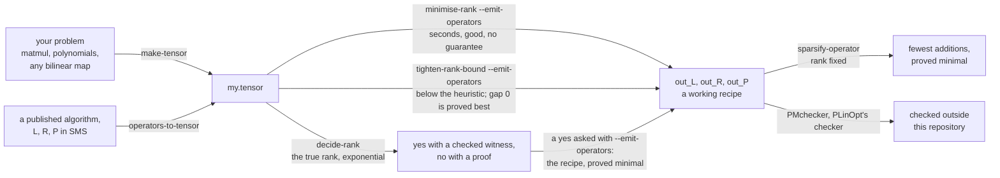

# tensor-rank-toolkit

[](https://github.com/Tewf/tensor-rank-toolkit/actions/workflows/ci.yml)
[](https://tewf.github.io/tensor-rank-toolkit/)
[](LICENSE)

> [Lire en français](README.fr.md)

A C++20 research library for exact tensor and bilinear rank over finite
fields and over the rationals. (A reader without this field's vocabulary can
start instead at [`start-here.md`](start-here.md).) The rank of a bilinear
map is the number of multiplications an optimal bilinear algorithm for it
uses; Strassen's seven for the 2×2 matrix product is the classical instance,
and such ranks are where fast matrix multiplication comes from. Deciding
tensor rank is NP-complete over finite fields [`[hastad1990]`](references.md)
and ∃ℝ-complete over the reals [`[schaefer2018]`](references.md), so the
library pairs **complete, exponential-time decision procedures** with
**heuristics that scan where the procedures search**, and with lower bounds
that do neither.
All arithmetic is exact, over GF(p) and ℚ via Givaro: a search over ranks and
over counts of nonzeros gives a different answer when it is nearly right, so
nothing here is ever a float. Every count below is asserted by the test
suite; timings are not, and are not claimed to be
([`MEASURING.md`](MEASURING.md) states the protocol,
[`evidence/reproduce/`](evidence/reproduce/) regenerates every published number with
its provenance).

## Repository layout

One row per strand: what it asks, on what guarantee, and its headline
number. The row is the whole claim; the strand's folder holds the depth, and
the long form across strands is [`what-it-computes.md`](what-it-computes.md).

| Strand | Asks, on what guarantee | Headline |
|---|---|---|
| [greedy heuristic](methods/bilinear_rank/greedy_heuristic/) | rank from above at the price of a scan: matroid-greedy passes over the `p^(n+m)` rank-one candidates, exact for its first step's basis, no guarantee past it | F2 5x5 to **14**, F3 3x6 to **10** |
| [exhaustion](methods/bilinear_rank/exhaustive/) | rank outright: a **complete decision procedure** after [`[bdez2012]`](references.md), exponential as NP-completeness leads one to expect | **rank of 2x2 matmul = 7**: 7 found and checked, 6 refuted |
| [branch and bound](methods/bilinear_rank/branch_and_bound/) | the same tree, cut by the incumbent's cost, stoppable at any moment | cyclic F2 7 from 15 to **13**, in 22 nodes |
| [rank sums](core/linear_algebra/tensor_rank_sum.h) | a floor with no search | GF(16) from 4 to **8**, in milliseconds |
| [pencils](methods/pencil_rank/) | two slices, in polynomial time, read off the Kronecker form | the Kronecker form, and where Ja'Ja' stops holding |
| [factorisation](methods/canonical_factorisation/) | the rank as `S = C A` | an answer with a receipt anybody can multiply out |
| [satisfiability](methods/satisfiability/) | the same question, to a SAT solver, its encoding after [`[heule2021]`](references.md) | pool-free, and a refutation checkable as DRAT, a proof an independent program verifies |
| [symmetry](methods/bilinear_rank/orbit_reduction/) | one member per orbit of the map's automorphisms | **39.2x fewer nodes** on a refutation, 261 121 maps to **13 orbits** |
| [isomorph-free](methods/bilinear_rank/canonical_augmentation/) | each class exactly once, no memory, after [`[mckay1998]`](references.md); an enumeration figure, and deciding instead trades 53x fewer nodes for 5.1x the wall clock | **22 778x fewer nodes** on 2x2 matmul, counting |
| [flip graph](methods/bilinear_rank/flip_graph/) | moving a working decomposition sideways, after [`[kauers2023]`](references.md): upper bounds only, and today's records are [`[moosbauer2025]`](references.md)'s | the ⟨2,2,2⟩ plateau crossed to **7** at a 380-state budget, the control at 370 refusing |
| [sparsification](methods/matrix_sparsification/) | fewer additions, rank fixed, after [`[karstadt2017]`](references.md) and [`[beniamini2020]`](references.md), perhaps their only public implementation ([the search, read narrowly](writeup/positioning/the-sparsification-strand.md)) | a rank-23 ⟨3,3,3⟩ scheme **221 nonzeros to 128**, the minimum over every change of basis, every entry left 0 or ±1 |

The groups around the strands:

| Group | Holds |
|---|---|
| [`core/`](core/linear_algebra/) | the exact arithmetic ([`linear_algebra/`](core/linear_algebra/)) and the file formats ([`formats/`](core/formats/)) |
| [`methods/bilinear_rank/`](methods/bilinear_rank/) | the search core above, one namespace, its shared vocabulary at the group root with `operators-to-tensor`, plus [`map_construction/`](methods/bilinear_rank/map_construction/) and [`search_plan/`](methods/bilinear_rank/search_plan/) |
| [`infrastructure/`](infrastructure/cli/) | [`cli/`](infrastructure/cli/), [`run_limits/`](infrastructure/run_limits/), [`testing/`](infrastructure/testing/), [`gpu_leaf/`](infrastructure/gpu_leaf/), [`tools/`](infrastructure/tools/) |
| [`evidence/`](evidence/fixtures/) | [`fixtures/`](evidence/fixtures/), [`benchmark_tensors/`](evidence/benchmark_tensors/), [`reproduce/`](evidence/reproduce/) |
| [`writeup/`](writeup/article/) | [`article/`](writeup/article/), [`how-the-search-works/`](writeup/how-the-search-works/), [`positioning/`](writeup/positioning/), [`the-research-front/`](writeup/the-research-front/) |
| [`web_interface/`](web_interface/) | the tools driven from a browser, on Python's standard library alone |
| [`start-here.md`](start-here.md) | a first session in plain words, for a reader without the field's vocabulary |
| [`what-is-where.md`](what-is-where.md), [`OPTIONS.md`](OPTIONS.md), [`references.md`](references.md) | the reasoned map; every flag with the measurement behind its default; the bibliography, keyed from the code |

Why thirteen command-line tools rather than eight, and the one question each
answers that no other does:
[`OPTIONS/one-question-per-command.md`](OPTIONS/one-question-per-command.md).

## Two measured facts

**The leaf is where the exhaustive search lives**, and neither of its two
routes forms an element any more: the walk steps in reflected Gray order over
GF(2) and GF(p) alike, **2.52x an element over GF(3)** with the dimension
term gone rather than reduced, and the pool scan carries a residual. Same
verdicts, same node counts, one consumer card priced against both:
[`infrastructure/gpu_leaf/`](infrastructure/gpu_leaf/).

**A negative result on the expensive step.** Step 3 of the greedy heuristic
enumerates the full pool of rank-one maps. Across the four polynomial
fixtures it improved the answer in **two of four cases**, by one product
each, at a cost **one to two orders of magnitude** above the first two steps
together. A continuation that only accelerates step 3 optimises the part
that mostly does not pay; [`evidence/fixtures/`](evidence/fixtures/) holds
that finding still.

## One pipeline

The rank search recovers ⟨L, R, P⟩; sparsification is what they are for. The
whole use, one drawing: two ways to a tensor, two finders and a decider on
it, and what a recipe is for.



The two lines a first session actually types:

```sh
minimise-rank evidence/fixtures/f2_5x5.tensor --emit-operators out   # 25 -> 14 products
sparsify-operator out_L.sms                                          # 31 -> 27 nonzeros
```

The browser console runs those two lines in order, once per operator, as a
flow: [`web_interface/`](web_interface/).

## Interchange with the published literature

A ⟨L, R, P⟩ triple in SMS is what the field publishes a bilinear algorithm
as, and very nearly the only thing it publishes, so that is the way in as
well as the way out. Two sources supply them in quantity: the
[FMM catalogue](https://fmm.univ-lille.fr/), thousands of decompositions
listed by rank, and [PLinOpt](https://github.com/jgdumas/plinopt), a C++
library for linear and bilinear straight-line programs whose `data/` ships
Strassen, Winograd, Karatsuba, Toom-3 and matrix multiplication up to
32x32x32.

Reading one is a test and not a claim: a Strassen triple published elsewhere
rebuilds the fixture this repository writes from the definition of the map,
entry for entry, and a disagreement would be ours to explain. **None of it is
a dependency**: nothing here links against any of those tools and the whole
suite passes on a machine where none is installed.

```sh
operators-to-tensor L.sms R.sms P.sms -q 2 > map.tensor     # a published algorithm, read in
PMchecker out_L.sms out_R.sms out_P.sms -q 2                # ours, checked elsewhere
```

Both directions and the differences that bite, on one page:
[`core/formats/interchange/exchanging-files.md`](core/formats/interchange/exchanging-files.md).

## Two branches

`main` is what won. **`rejected-experiments` is what lost, kept whole**: the
measurement that decided each rejection and the implementation it retired,
because a rejection whose evidence was deleted is indistinguishable from a
whim. On it are the orbit walk the canonical image replaced, the quotient by
default that a find pays 7.4x for, `[beniamini2020]`'s two exact
sparsification oracles with the row-basis heuristic, and `find-at-rank` with
its descending sweep. Nothing there is broken and nothing there is
maintained. The index of all of it, with the number that retired each:
[`retired/README.md`](https://github.com/Tewf/tensor-rank-toolkit/blob/rejected-experiments/retired/README.md).

## Building

Needs a C++20 compiler, CMake ≥ 3.22 with `pkg-config`, **Givaro** and
**Boost's headers**:

```sh
sudo apt install cmake ninja-build pkg-config libgivaro-dev libgmp-dev libboost-dev
```

Givaro and Boost are the only libraries anything links. Boost is needed by
[`vendor/permlib/`](vendor/permlib/) alone, for `boost::next` and
`boost::shared_ptr`, and no header outside that vendored library includes it.
`libgmp-dev` is on the line because `libgivaro-dev` pulls GMP's runtime but
not `gmpxx.h`, which Givaro's own headers include; the
[`Containerfile`](Containerfile) found that by failing to build. Every solver
is optional and located on `PATH` at run time. `ccache` is used when
installed and ignored when not, and the [`Containerfile`](Containerfile) pins
an environment for reproducing a published number.

```sh
cmake -B build -G Ninja && cmake --build build
ctest --test-dir build            # everything, about two minutes
ctest --test-dir build -LE slow   # skip the expensive searches
cmake --install build --prefix ~/.local   # the thirteen tools, onto PATH
```

**Every documented command line types its tool bare**, `minimise-rank …`,
which assumes the install above. Without it the same binaries sit under the
module that owns each, `build/` plus that command's folder in the strand
table above plus its name: `build/methods/bilinear_rank/greedy_heuristic/minimise-rank`,
or `build/methods/matrix_sparsification/sparsify-operator` for sparsification,
and so on for the rest. The lines run with that prefix instead. The three instruments and the
`list-solvers` shim deliberately do not install; the top `CMakeLists.txt`
says why. A reader new to the area starts at
[`start-here.md`](start-here.md).

Add `-DCMAKE_EXPORT_COMPILE_COMMANDS=ON` and symlink the result to the top of
the tree (`ln -sf build/compile_commands.json .`) to give clangd, and any
editor or agent that speaks to it, the real flags. Without it, every module's
headers look missing, because each one owns its own include directory.

## Citing

[`CITATION.cff`](CITATION.cff). Licence: MIT; [`LICENSE`](LICENSE) and
[`NOTICE`](NOTICE) give the scope and credit what is not mine.

## References

Every result any of this implements is cited in the code by a key into
[`references.md`](references.md), which holds the full annotated
bibliography. The complexity results framing the undertaking: J. Håstad,
*Tensor rank is NP-complete*, J. Algorithms 11 (1990),
[`[hastad1990]`](references.md); M. Schaefer and D. Štefankovič, *The
complexity of tensor rank*, Theory Comput. Syst. 62 (2018),
[`[schaefer2018]`](references.md); C. J. Hillar and L.-H. Lim, *Most tensor
problems are NP-hard*, J. ACM 60 (2013), [`[hillar2013]`](references.md).
The key each strand implements stands in its row of the layout table above.
