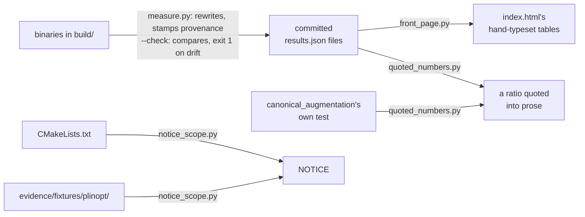

# Reproducing the published numbers

The one command a reviewer runs, from the repository root, after building:

```sh
python3 evidence/reproduce/measure.py --build build --check   # exit 1 on any drift
```

A clean run prints one SKIPPED line per figure it left to the committed files
and ends:

```
every published count still reproduces, bar the 5 printed SKIPPED above
```

It re-derives every published **count** and compares; it does not look at
timings, and why it must not is the first thing
[`measure.py`](measure.py)'s own header explains, along with the other three
invocations (full rewrite, `--counts`, `--slow`). The protocol a timing was
taken under is [`../../MEASURING.md`](../../MEASURING.md).

Four guards hold one file's claim to the file it must agree with, and CI runs
`measure.py --check` first and the other three even when it fails
([`../../.github/workflows/ci.yml`](../../.github/workflows/ci.yml)):



Five files, one role each, and each says its own rules at the top:

- [`measure.py`](measure.py): runs the invocations and compares or rewrites
  the results files, stamping provenance on everything it writes.
- [`questions.py`](questions.py): what the questions are, every published
  number as the invocation that produces it.
- [`front_page.py`](front_page.py): that `index.html`'s hand-typeset tables
  are the results files.
- [`quoted_numbers.py`](quoted_numbers.py): that a ratio typed into prose is
  the one something else asserts; when a sentence pairs a checked figure with
  a wall clock, its header says which half that is.
- [`notice_scope.py`](notice_scope.py): that NOTICE claims every directory
  the build adds, and counts what it credits.
