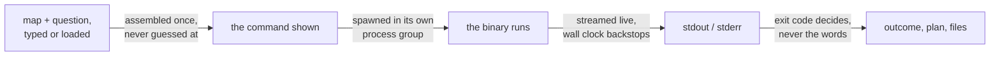

# A console for the toolkit

A local web interface that takes a bilinear map typed, pasted or loaded from a
file, runs any of the command-line tools on it, and shows the answer with the
exact command that produced it. It shells out to the built binaries and
implements no mathematics of its own.

## Running it

Two steps, and the first is the repository's own.

```sh
cmake -B build -G Ninja && cmake --build build   # Givaro is the only dependency
python3 web_interface/serve.py                   # opens http://localhost:8770/
```

Nothing else is installed: the server is the Python 3 standard library and the
interface is a browser, so it needs exactly what building the toolkit needed.
[`why-a-browser.md`](why-a-browser.md) prices the alternatives.

It listens on the loopback address, so only this machine can reach it, and
`ssh -L 8770:localhost:8770 host` is how it drives a run on a server. The flags
are `--build`, `--port`, `--host`, `--runs`, `--wall-clock` and `--no-browser`;
`--help` lists them. `--host` takes the address this machine is reached at,
never a wildcard: `0.0.0.0` is refused at startup, because the Host-header
guard would then have no name to accept and every remote request would be
refused after the bind.

## What you do with it

Four columns, all on the screen at once: the map, what was read back, the
question, and how it is asked over the answer it gave. That last one is stacked
rather than beside because its two are read in sequence: the flags, then the
command they built, then that same command again under the answer. Only a pane
scrolls, never the page. `layout.css` is the shell, `console.css` the filling.

**Start here.** Seven worked examples, behind the button of that name, in
[`worked_examples.py`](worked_examples.py); a console with no runs yet opens
them on its own, since the empty screen and the first-time visitor are the
same event. Each fills the map, the question and
the flags and then stops, so the line is read before it is run. Three of them
are the same map one flag apart, the shortest way to see found against proved
impossible, with and without the quotient; a fourth shows a budget running
out, which proves nothing. The last is the pipeline below.

Each flag's control carries the measurement behind its default, shut behind
its own "why this default" line, so the pane reads as choices first and as
documentation on request.

1. **The map.** Type it, paste it, load one of the repository's fixtures, open a
   file, or build one with `make-tensor`. The format is the one that already
   exists, `core/formats/tensor_file.h`, and nothing new was invented. The fixtures
   the chosen tool cannot read are greyed rather than hidden.
**What bounds a run is on the same screen**, shut by default, in the run pane
above the button: the machine as the kernel reports it, the ceilings derived from
it, and every tunable with the value in force and where it came from. It is
`show-limits`' own output with the line that produced it, parsed by nothing here.
Editing those values is deliberately not offered: `tunables.conf` belongs to the
checkout and a browser that wrote to it would change what every other run on this
machine is bounded by. Per-run limits are flags and are already in the options
panel.

2. **The question.** Every tool but two, each stating what it asks.
   `make-tensor` fills the pane above instead, and `operators-to-tensor` is not
   here at all because it reads three files at once and this console offers one.
   Which tools those are is checked against the build rather than counted, and
   so is every flag of every one of them: a tool or a flag shipping without
   reaching this console is a failing check and not a quiet omission, and
   everything left off is named with its reason in that check. The flags are the
   ones each binary's own `--help` prints, each carrying the note that says what
   it costs, which is `OPTIONS.md`'s wherever that page has one. Under the twelve is [`flows.py`](flows.py), which is the other kind of
   question: `README.md`'s pipeline, where `minimise-rank --emit-operators` is
   followed by `sparsify-operator` on each operator it wrote. A flow adds no
   binary, no flag and no mathematics, only the order, and each of its steps is
   an ordinary run with its own command, its own card and its own exit code.
3. **The command.** Shown before you run it and again beside the answer, as a
   line you can retype at a terminal, with a button that copies it. Anything
   worth knowing before you press Run is said underneath it.
4. **The answer.** Three things, in this order: **how it ended**, as the tool's
   own word and as one of found, proved and nothing proved; **the plan the tool
   printed**, its pool, its leaf, its device and its quotient, lifted out of the
   stream; then both streams kept apart as `infrastructure/cli/report.h` splits them, and any
   file the run wrote.

Between the command and the answer is one path, walked the same way every time.
[`service.py`](service.py) assembles it, [`runner.py`](runner.py) runs it, and
what the exit code at the far end may conclude is
[`what-it-will-not-say.md`](what-it-will-not-say.md)'s:



An unmodified fixture is run where it lies, so the line under the answer is the
same one the repository's own documents use. Anything typed is written into the
run's directory first, and that path is what the line then names.

## The first two starters, end to end

```
build/methods/bilinear_rank/exhaustive/decide-rank evidence/fixtures/matmul_2x2x2.tensor --target 7
exit 0, FOUND: 7 products, rank bound 6, gap 1;  verified: they compute the map

build/methods/bilinear_rank/exhaustive/decide-rank evidence/fixtures/matmul_2x2x2.tensor --target 6
exit 1, NO:    there is no algorithm with 6 products. The search was exhaustive.
```

Two runs and the rank of `⟨2,2,2⟩` is 7, and both lines run unchanged in a
terminal. No timing is quoted, because a wall clock taken beside a browser is
not one `MEASURING.md` would accept.

## What it will not do

It will not turn a budget that ran out into a proof, and
[`what-it-will-not-say.md`](what-it-will-not-say.md) is how that is kept. It
will not leave a search running when you stop it, which is
`infrastructure/run_limits/child_process.h`'s rule applied one level up. What is not finished is
in [`not-production-ready-yet.md`](not-production-ready-yet.md) rather than left
to be discovered.

## Checking it

```sh
python3 web_interface/tests/check_web_interface.py     # 65 checks
```

It starts a console, drives it over HTTP and asserts against real runs of real
binaries: that exit 3 arrives as undecided and never as a refutation, that the
plan lines it promotes are still the characters the tools print, that the tools
it offers are the binaries the build produced and their flags the flags those
binaries print, that the pipeline's second tool really reads what its first one
wrote, and that each of the seven worked examples still ends where it says it
does. The catalogue half runs the binaries rather than the console and is
[`tests/catalogue_against_the_build.py`](tests/catalogue_against_the_build.py),
reported here so there stays one list and one count. It is deliberately not
registered with `ctest`, whose count is quoted elsewhere and means something else.
